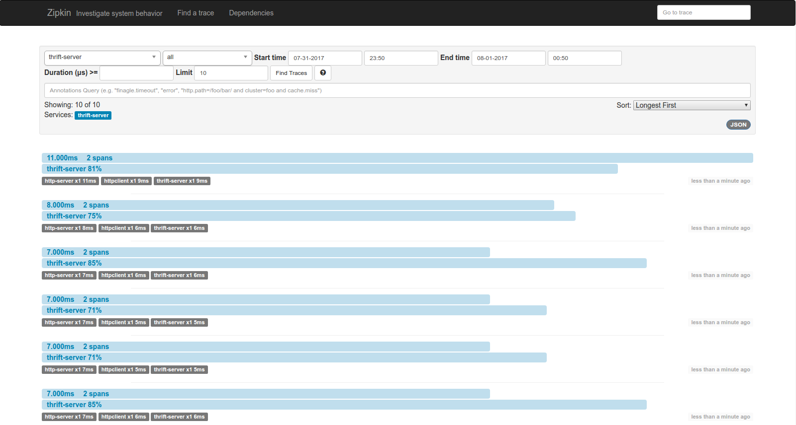
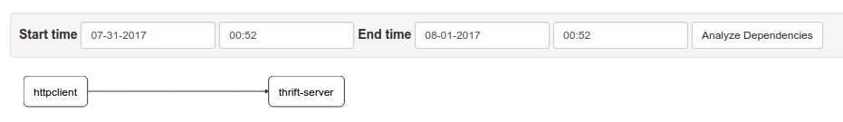

# finatra_zipkin_example
This is finatra + http + thrift + zipkin Example.

### There is 5 sub-project.
- example-core: core sub project which used by http-server, thrift-server 
- thrift-idl is project for thrift file. It made Scala case class by scrooge.
- thrift-server is project for finatra thrift server. Called by Http Server
- thrift-server is project for finatra http server. frontend call Thrift Server
- thrift-client is wrapping project used by http server.

Further explain is in [](here) 

---

### How to test this example

- [ ] start zipkin
```bash
$ docker run -d -p 9411:9411 -p 9410:9410 -e SCRIBE_ENABLED=true openzipkin/zipkin
```

You can see Zipkin UI in [http://localhost:9411/zipkin/](http://localhost:9411/zipkin/)

- [ ] start http-server
```bash
$ sbt 'project http-server' "run -http.name=http-server -com.twitter.finagle.zipkin.host=localhost:9410 -com.twitter.finagle.zipkin.initialSampleRate=1"
```

- [ ] start thrift-server
```bash
$ sbt 'project thrift-server' "-thrift.name=thrift-server -com.twitter.finagle.zipkin.host=localhost:9410 -com.twitter.finagle.zipkin.initialSampleRate=1"
```


### queries
#### get
/users

/user/:userId

/user/car/

/user/:userId/car

#### post
/user

body example:

```json
{
  "user_id": 4,
  "user_name": "suhyun",
  "user_age": 26,
  "sex": false,
  "car_name": {
    "car_name": "BMW",
    "serial_number": 123
  }
}

```


### Zipkin UI


### Denpendencies
